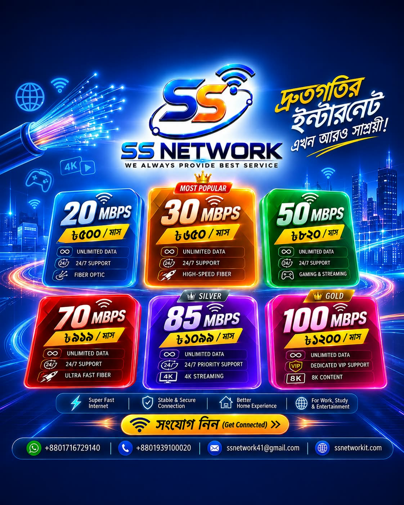

<html lang="bn">
<head>
  <meta charset="UTF-8" />
  <meta name="viewport" content="width=device-width, initial-scale=1.0" />
  <title>SS Network · ISP</title>
  
  <!-- Favicon Link -->
  <link rel="icon" type="image/x-icon" href="favicon.ico" />

  <!-- Tailwind CSS CDN -->
  
  
  <!-- Google Fonts: Poppins + Kalpurush -->
  <link rel="preconnect" href="https://fonts.googleapis.com" />
  <link rel="preconnect" href="https://fonts.gstatic.com" crossorigin />
  <link href="https://fonts.googleapis.com/css2?family=Poppins:wght@400;600;700;800&family=Kalpurush:wght@400;500;600;700&display=swap" rel="stylesheet" />
  
  <!-- Font Awesome 6 -->
  <link rel="stylesheet" href="https://cdnjs.cloudflare.com/ajax/libs/font-awesome/6.0.0-beta3/css/all.min.css" />
  
</head>
<body>

  <!-- ========== HEADER ========== -->
  <header id="mainHeader" class="fixed top-0 left-0 w-full z-50 bg-white/90 transition-all duration-300 border-b border-gray-100">
    

      

        

          
          

            SS NETWORK
            WE ALWAYS PROVIDE BEST SERVICE
          

        

      

      <nav class="hidden md:flex items-center gap-8 font-poppins font-medium text-sm text-gray-700">
        <a href="#home" class="hover:text-red-primary transition">Home</a>
        <a href="#why" class="hover:text-red-primary transition">Why SS</a>
        <a href="#packages" class="hover:text-red-primary transition">Packages</a>
        <a href="#contact" class="hover:text-red-primary transition">Contact</a>
      </nav>

      

        <a href="tel:01716729140" class="hidden md:flex items-center gap-1.5 bg-red-primary/10 text-red-primary font-semibold px-4 py-2 rounded-full text-sm hover:bg-red-primary hover:text-white transition">
          <i class="fas fa-phone"></i> 01716729140
        </a>
        <button id="menuToggle" class="md:hidden text-2xl text-gray-700 focus:outline-none" aria-label="menu">
          <i class="fas fa-bars"></i>
        </button>
      

    

    <!-- মোবাইল মেনু -->
    

      

        <a href="#home" class="hover:text-red-primary py-1 border-b border-gray-50">Home</a>
        <a href="#why" class="hover:text-red-primary py-1 border-b border-gray-50">Why SS</a>
        <a href="#packages" class="hover:text-red-primary py-1 border-b border-gray-50">Packages</a>
        <a href="#contact" class="hover:text-red-primary py-1 border-b border-gray-50">Contact</a>
        
        <a href="tel:01716729140" class="mt-2 bg-red-primary/10 text-red-primary font-semibold px-4 py-2 rounded-full text-center flex items-center justify-center gap-2">
          <i class="fas fa-phone"></i> 01716729140
        </a>
      

    

  </header>

  <!-- ============================================================ -->
  <!-- ========== SLIDER SECTION (হেডার ও হিরোর মাঝে) ========= -->
  <!-- ============================================================ -->
  <section class="slider-container pt-28 md:pt-36 pb-4">
    

      

        
        <!-- ===== আপনার GitHub ইমেজ এখানে বসান ===== -->
        <!-- Slide 1 -->
        

          
        

        <!-- Slide 2 -->
        

          
        

        <!-- Slide 3 -->
        

          
        

        <!-- Slide 4 -->
        

          
        

        <!-- Slide 5 -->
        

          
        

        <!-- ===== ইমেজ শেষ ===== -->
        
      

      <!-- Prev / Next Buttons -->
      <button class="slider-btn prev" id="prevBtn" aria-label="Previous slide">
        <i class="fas fa-chevron-left"></i>
      </button>
      <button class="slider-btn next" id="nextBtn" aria-label="Next slide">
        <i class="fas fa-chevron-right"></i>
      </button>
    

    <!-- Dots / Indicators -->
    

  </section>

  <!-- ========== HERO SECTION ========== -->
  <section id="home" class="pt-8 pb-8 bg-gradient-to-br from-red-50 via-blue-50/20 to-white">
    

      

        <h1 class="font-poppins font-extrabold text-3xl sm:text-4xl md:text-5xl lg:text-5xl leading-tight text-dark max-w-fit mx-auto md:mx-0">
          হাই-স্পিড ইন্টারনেট
          এখন আপনার শহরে
        </h1>
        
        

          WE ALWAYS PROVIDE BEST SERVICE
        

        

          <a href="#packages" class="bg-red-primary hover:bg-red-700 text-white font-semibold px-8 py-3.5 rounded-full shadow-lg transition flex items-center gap-2">
            <i class="fas fa-wifi"></i> প্যাকেজ দেখুন
          </a>
          <a href="https://wa.me/8801716729140" target="_blank" class="bg-green-primary hover:bg-green-700 text-white font-semibold px-8 py-3.5 rounded-full shadow-lg transition flex items-center gap-2">
            <i class="fab fa-whatsapp"></i> যোগাযোগ করুন
          </a>
        

      

      

        

      

    

  </section>

  <!-- ========== WHY SS NETWORK SECTION ========== -->
  <section id="why" class="py-14 bg-white border-t border-gray-100">
    

      <h2 class="font-poppins font-bold text-3xl md:text-4xl text-center text-dark mb-3">
        কেন SS NETWORK ব্যবহার করবেন?
      </h2>
      
আমরা গ্রাহকদের সর্বোচ্চ মানের সেবা নিশ্চিত করতে সর্বদা প্রস্তুত। দেখে নিন কেন আমরা সেরা:

      

        

          
<i class="fas fa-tachometer-alt"></i>

          <h3 class="font-bold text-lg mb-3 border-b pb-2">স্পিড ও কানেকশন</h3>
          <ul class="space-y-2.5 text-gray-700">
            <li><i class="fas fa-check-circle text-green-500 mr-2"></i>হাই-স্পিড, স্টেবল কানেকশন — কোনো বাফারিং নেই</li>
            <li><i class="fas fa-check-circle text-green-500 mr-2"></i>লো ল্যাটেন্সি — গেমিং ও অনলাইন ক্লাসের জন্য পারফেক্ট</li>
            <li><i class="fas fa-check-circle text-green-500 mr-2"></i>২৪ ঘণ্টা আনলিমিটেড ডেটা, কোনো FUP লিমিট নেই</li>
          </ul>
        

        

          
<i class="fas fa-headset"></i>

          <h3 class="font-bold text-lg mb-3 border-b pb-2">সার্ভিস ও সাপোর্ট</h3>
          <ul class="space-y-2.5 text-gray-700">
            <li><i class="fas fa-check-circle text-green-500 mr-2"></i>২৪/৭ কাস্টমার সাপোর্ট — যেকোনো সমস্যায় সাথে সাথে সমাধান</li>
            <li><i class="fas fa-check-circle text-green-500 mr-2"></i>দ্রুত টেকনিক্যাল টিম রেসপন্স</li>
            <li><i class="fas fa-check-circle text-green-500 mr-2"></i>সহজ পেমেন্ট সিস্টেম (bKash/Nagad/ক্যাশ)</li>
          </ul>
        

        

          
<i class="fas fa-shield-alt"></i>

          <h3 class="font-bold text-lg mb-3 border-b pb-2">মূল্য ও বিশ্বাসযোগ্যতা</h3>
          <ul class="space-y-2.5 text-gray-700">
            <li><i class="fas fa-check-circle text-green-500 mr-2"></i>সাশ্রয়ী মূল্যে সেরা সার্ভিস — কোনো হিডেন চার্জ নেই</li>
            <li><i class="fas fa-check-circle text-green-500 mr-2"></i>লোকাল এরিয়ার মধ্যে বিশ্বস্ত ও পরিচিত প্রোভাইডার</li>
            <li><i class="fas fa-check-circle text-green-500 mr-2"></i>নমনীয় প্যাকেজ — প্রয়োজন অনুযায়ী প্যাকেজ পরিবর্তনের সুবিধা</li>
          </ul>
        

        

          
<i class="fas fa-network-wired"></i>

          <h3 class="font-bold text-lg mb-3 border-b pb-2">ইনফ্রাস্ট্রাকচার</h3>
          <ul class="space-y-2.5 text-gray-700">
            <li><i class="fas fa-check-circle text-green-500 mr-2"></i>আধুনিক ফাইবার অপটিক নেটওয়ার্ক</li>
            <li><i class="fas fa-check-circle text-green-500 mr-2"></i>৯৯.৯% আপটাইম গ্যারান্টি</li>
            <li><i class="fas fa-check-circle text-green-500 mr-2"></i>ওয়েদার-প্রুফ স্টেবল কানেকশন (বৃষ্টি/ঝড়েও নেট বন্ধ হয় না)</li>
          </ul>
        

      

    

  </section>

  <!-- ========== PACKAGES SECTION ========== -->
  <section id="packages" class="py-16 bg-soft-gray border-t border-gray-200/60">
    

      <h2 class="font-poppins font-bold text-4xl text-center text-dark mb-2">আমাদের প্যাকেজ</h2>
      
আপনার পছন্দ অনুযায়ী যেকোনো প্যাকেজ বেছে নিন

      
      

        <!-- 20 Mbps -->
        

          

            <h3 class="font-poppins font-bold text-2xl">20 Mbps</h3>
            
৳৫০০ /মাস

            <ul class="mt-4 space-y-2 text-gray-700">
              <li><i class="fas fa-check text-green-primary mr-2"></i>আনলিমিটেড ডেটা</li>
              <li><i class="fas fa-check text-green-primary mr-2"></i>২৪/৭ সাপোর্ট</li>
              <li><i class="fas fa-check text-green-primary mr-2"></i>ফাইবার অপটিক সংযোগ</li>
            </ul>
          

          <a href="#contact" class="mt-6 block text-center bg-blue-primary hover:bg-blue-600 text-white font-semibold py-2.5 rounded-full transition">সংযোগ নিন</a>
        

        <!-- 30 Mbps -->
        

          Most Popular
          

            <h3 class="font-poppins font-bold text-2xl">30 Mbps</h3>
            
৳৬৫০ /মাস

            <ul class="mt-4 space-y-2 text-gray-700">
              <li><i class="fas fa-check text-green-primary mr-2"></i>আনলিমিটেড ডেটা</li>
              <li><i class="fas fa-check text-green-primary mr-2"></i>২৪/৭ সাপোর্ট</li>
              <li><i class="fas fa-check text-green-primary mr-2"></i>হাই-স্পিড ফাইবার</li>
            </ul>
          

          <a href="#contact" class="mt-6 block text-center bg-orange-primary hover:bg-orange-600 text-white font-semibold py-2.5 rounded-full transition">সংযোগ নিন</a>
        

        <!-- 50 Mbps -->
        

          

            <h3 class="font-poppins font-bold text-2xl">50 Mbps</h3>
            
৳৮২০ /মাস

            <ul class="mt-4 space-y-2 text-gray-700">
              <li><i class="fas fa-check text-green-primary mr-2"></i>আনলিমিটেড ডেটা</li>
              <li><i class="fas fa-check text-green-primary mr-2"></i>২৪/৭ সাপোর্ট</li>
              <li><i class="fas fa-check text-green-primary mr-2"></i>গেমিং ও স্ট্রিমিং</li>
            </ul>
          

          <a href="#contact" class="mt-6 block text-center bg-green-primary hover:bg-green-600 text-white font-semibold py-2.5 rounded-full transition">সংযোগ নিন</a>
        

        <!-- 70 Mbps -->
        

          

            <h3 class="font-poppins font-bold text-2xl">70 Mbps</h3>
            
৳৯৯৯ /মাস

            <ul class="mt-4 space-y-2 text-gray-700">
              <li><i class="fas fa-check text-green-primary mr-2"></i>আনলিমিটেড ডেটা</li>
              <li><i class="fas fa-check text-green-primary mr-2"></i>২৪/৭ সাপোর্ট</li>
              <li><i class="fas fa-check text-green-primary mr-2"></i>আল্ট্রা ফাস্ট ফাইবার</li>
            </ul>
          

          <a href="#contact" class="mt-6 block text-center bg-red-primary hover:bg-red-700 text-white font-semibold py-2.5 rounded-full transition">সংযোগ নিন</a>
        

        <!-- সিলভার (Silver) - 85 Mbps -->
        

          

            

              <h3 class="font-poppins font-bold text-2xl">85 Mbps</h3>
              Silver
            

            
৳১০৯৯ /মাস

            <ul class="mt-4 space-y-2 text-gray-700">
              <li><i class="fas fa-check text-green-primary mr-2"></i>আনলিমিটেড ডেটা</li>
              <li><i class="fas fa-check text-green-primary mr-2"></i>২৪/৭ প্রাইওরিটি সাপোর্ট</li>
              <li><i class="fas fa-check text-green-primary mr-2"></i>হেভি ডাউনলোডিং ও 4K স্ট্রিমিং</li>
            </ul>
          

          <a href="#contact" class="mt-6 block text-center bg-purple-primary hover:bg-purple-700 text-white font-semibold py-2.5 rounded-full transition">সংযোগ নিন</a>
        

        <!-- গোল্ড (Gold) - 100 Mbps -->
        

          

            

              <h3 class="font-poppins font-bold text-2xl">100 Mbps</h3>
              Gold
            

            
৳১২০০ /মাস

            <ul class="mt-4 space-y-2 text-gray-700">
              <li><i class="fas fa-check text-green-primary mr-2"></i>আনলিমিটেড ডেটা</li>
              <li><i class="fas fa-check text-green-primary mr-2"></i>ডেডিকেটেড VIP সাপোর্ট</li>
              <li><i class="fas fa-check text-green-primary mr-2"></i>বাফারিং ছাড়া ৪K/৮K কন্টেন্ট</li>
            </ul>
          

          <a href="#contact" class="mt-6 block text-center bg-yellow-primary hover:bg-yellow-700 text-white font-semibold py-2.5 rounded-full transition">সংযোগ নিন</a>
        

      

    

  </section>

  <!-- ========== CONTACT FORM SECTION ========== -->
  <section id="contact" class="py-16 bg-white">
    

      <h2 class="font-poppins font-bold text-3xl md:text-4xl text-center text-dark mb-2">নতুন কানেকশনের জন্য যোগাযোগ করুন</h2>
      
নিচের ফর্মটি পূরণ করুন, আমরা আপনার সাথে দ্রুত যোগাযোগ করবো

      

        <form id="connectionForm">
          

            

              <label class="form-label" for="userName">নাম :</label>
              <input type="text" id="userName" class="form-input" placeholder="আপনার পুরো নাম লিখুন" required />
            

            

              <label class="form-label" for="userMobile">মোবাইল নাম্বার :</label>
              <input type="tel" id="userMobile" class="form-input" placeholder="01XXXXXXXXX" required />
            

            

              <label class="form-label" for="userEmail">ইমেইল :</label>
              <input type="email" id="userEmail" class="form-input" placeholder="example@mail.com" />
            

            

              <label class="form-label" for="userAddress">সম্পূর্ণ ঠিকানা :</label>
              <textarea id="userAddress" class="form-input" rows="2" placeholder="আপনার বিস্তারিত ঠিকানা লিখুন" required></textarea>
            

            

              <label class="form-label" for="connectionType">কানেকশন টাইপ :</label>
              <select id="connectionType" class="form-input cursor-pointer">
                <option value="হোম" selected>হোম</option>
                <option value="অফিস">অফিস</option>
                <option value="শপ">শপ</option>
                <option value="কর্পোরেট">কর্পোরেট</option>
              </select>
            

            

              <label class="form-label" for="packageSelect">প্যাকেজ সিলেক্ট :</label>
              <select id="packageSelect" class="form-input cursor-pointer">
                <option value="20 Mbps - ৳৫০০/মাস">20 Mbps (৳৫০০/মাস)</option>
                <option value="30 Mbps - ৳৬৫০/মাস">30 Mbps (৳৬৫০/মাস)</option>
                <option value="50 Mbps - ৳৮২০/মাস">50 Mbps (৳৮২০/মাস)</option>
                <option value="70 Mbps - ৳৯৯৯/মাস">70 Mbps (৳৯৯৯/মাস)</option>
                <option value="Silver (85 Mbps) - ৳১০৯৯/মাস">Silver - 85 Mbps (৳১০৯৯/মাস)</option>
                <option value="Gold (100 Mbps) - ৳১২০০/মাস">Gold - 100 Mbps (৳১২০০/মাস)</option>
              </select>
            

            

              <button type="submit" class="btn-submit">
                Submit
              </button>
            

          

        </form>
      

    

  </section>

  <!-- ========== FOOTER ========== -->
  <footer class="bg-[#1a1a1a] pt-16 pb-6">
    

      

        

          
          SS NETWORK
        

        
WE ALWAYS PROVIDE BEST SERVICE

        
        

          <i class="fas fa-map-marker-alt text-red-primary text-base mt-1"></i>
          Alom House, 2nd floor, Islamia Road, Sonapur, Sadar, Noakhali.
        

      

      

        <h4 class="font-poppins font-semibold text-white mb-3">Quick Links</h4>
        <ul class="space-y-2 text-base">
          <li><a href="#home" class="text-gray-300 hover:text-white transition">Home</a></li>
          <li><a href="#why" class="text-gray-300 hover:text-white transition">Why SS</a></li>
          <li><a href="#packages" class="text-gray-300 hover:text-white transition">Packages</a></li>
          <li><a href="#contact" class="text-gray-300 hover:text-white transition">Contact</a></li>
        </ul>
      

      

        <h4 class="font-poppins font-semibold text-white mb-3">যোগাযোগ</h4>
        
        

          <a href="tel:01716729140" class="text-gray-300 hover:text-white transition flex items-center gap-2">
            <i class="fas fa-phone text-red-primary"></i> 01716729140
          </a>
        

        

          <a href="mailto:ssnetwork41@gmail.com" class="text-gray-300 hover:text-white transition flex items-center gap-2">
            <i class="fas fa-envelope text-red-primary"></i> ssnetwork41@gmail.com
          </a>
        

        

          <a href="https://www.facebook.com/share/14psW5MGT5i/" target="_blank" class="text-gray-300 hover:text-blue-500 transition" aria-label="Facebook">
            <i class="fab fa-facebook"></i>
          </a>
          <a href="https://wa.me/8801716729140" target="_blank" class="text-gray-300 hover:text-green-400 transition" aria-label="WhatsApp">
            <i class="fab fa-whatsapp"></i>
          </a>
        

      

    

    

      © 2026 SS Network. All Rights Reserved.
    

  </footer>

  <!-- ========== FLOATING WHATSAPP ========== -->
  <a href="https://wa.me/8801716729140" target="_blank" class="whatsapp-float" aria-label="WhatsApp chat">
    <i class="fab fa-whatsapp"></i>
    WhatsApp-এ নক দিন
  </a>

  <!-- ========== THANK YOU OVERLAY MODAL ========== -->
  

    

      <i class="fas fa-check-circle"></i>
      <h3 class="font-poppins font-bold text-2xl text-dark mb-2">Thank You!</h3>
      
আপনার তথ্যসমূহ সফলভাবে জমা নেওয়া হয়েছে। আমাদের প্রতিনিধি শীঘ্রই আপনার দেওয়া নাম্বারে যোগাযোগ করবে।

      <button id="closeModalBtn" class="bg-red-primary hover:bg-red-700 text-white font-semibold px-6 py-2.5 rounded-full transition w-full">
        ঠিক আছে
      </button>
    

  

  <!-- ============================================================ -->
  <!-- ========== SLIDER JAVASCRIPT ========= -->
  <!-- ============================================================ -->
  

  <!-- ========== MAIN JAVASCRIPT (Header, Form, Modal) ========= -->
  

</body>
</html>
